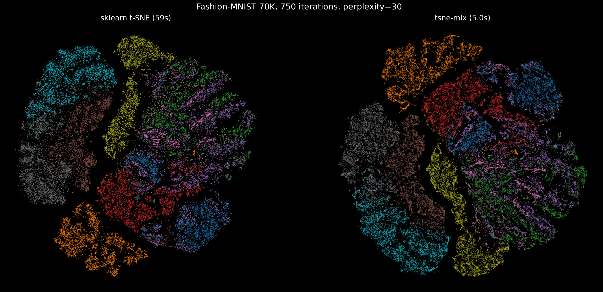

# tsne-mlx

t-SNE implementation in pure MLX for Apple Silicon. No PyTorch, no CUDA -- runs on Metal GPU.

Exact algorithm (not Barnes-Hut). Best suited for datasets up to ~2K-3K points where it outperforms sklearn by 2-3x. For larger datasets, sklearn's Barnes-Hut approximation is faster.

## Install

```bash
git clone https://github.com/hanxiao/tsne-mlx.git && cd tsne-mlx
uv venv .venv && source .venv/bin/activate
uv pip install -e .
```

## Usage

```python
from tsne_mlx import TSNE
import numpy as np

X = np.random.randn(1000, 128).astype(np.float32)
Y = TSNE(n_components=2, perplexity=30, n_iter=1000).fit_transform(X)
```

Parameters:

- `n_components`: output dimensions (default 2)
- `perplexity`: effective number of neighbors (default 30)
- `learning_rate`: SGD learning rate (default 200)
- `n_iter`: optimization iterations (default 1000)
- `early_exaggeration`: P scaling factor for early iterations (default 12)
- `random_state`: seed for reproducibility
- `verbose`: print KL divergence every N iterations (0 = silent)

## Benchmark (M3 Ultra)

```
N       sklearn    MLX      speedup
1000    1.65s      0.49s    3.4x
2000    2.32s      0.99s    2.3x
5000    3.50s      4.74s    0.7x
```

MLX wins at N < ~3K due to GPU-parallel pairwise distance and gradient computation. sklearn's Barnes-Hut (O(n log n)) scales better beyond that.

## Comparison

Fashion-MNIST (10K samples, 784 dims, 10 classes):



Both produce well-separated clusters. Layout differs due to random initialization (expected for t-SNE).

Fashion-MNIST created by Han Xiao et al. (11,000+ citations).

## How it works

1. Pairwise distances computed on Metal GPU via `||x||^2 + ||y||^2 - 2x.y`
2. Binary search for per-point sigma to achieve target perplexity
3. Symmetrize and normalize joint probabilities
4. Gradient descent with momentum, adaptive gains, early exaggeration
5. Gradient computed without materializing O(n^2 * d) tensor: uses `row_sums * Y - weights @ Y`

## License

MIT
